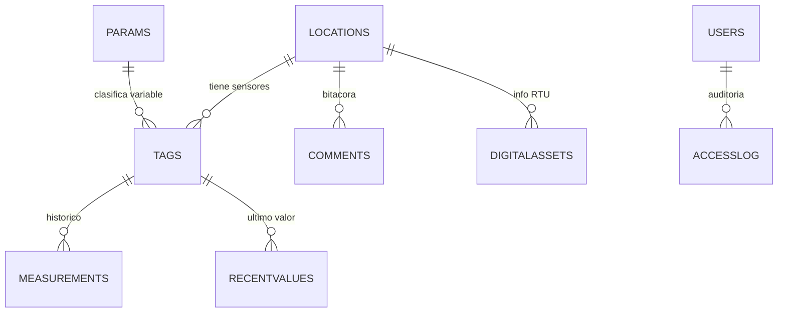

# Reto Agrotech UPEC - Entregable tecnico

## Interpretacion correcta del reto

La base `Insights` del servidor entregado para el evento es un clon seguro de la base original de YDOC Insight. Los PDFs de HUACA y CAYAMBE representan ejemplos de reportes/lecturas que existen o pueden existir en el servidor principal, al cual no se tiene acceso directo.

Por tanto, el objetivo tecnico no es alterar la base clonada, sino:

1. Auditar la estructura SQL Server clonada.
2. Deducir el DER logico del sistema YDOC Insight.
3. Crear consultas seguras para extraer variables meteorologicas.
4. Transformar el modelo normalizado en datos listos para un dashboard web.
5. Documentar una propuesta viable para conectar la solucion al servidor real de UPEC.

## Lo que pide la guia

El reto pide desarrollar una propuesta integral de visualizador web interactivo para las 6 estaciones meteorologicas UPEC:

- Tulcan
- Huaca
- Santa Martha de Cuba
- Mira
- La Concepcion
- Cayambe

Usuarios finales:

- estudiantes
- investigadores
- agricultores
- GADs e instituciones locales
- publico general

Variables esperadas:

- temperatura
- precipitacion
- humedad
- velocidad del viento
- direccion del viento
- radiacion solar
- bateria
- humedad de hoja
- nitrogeno, fosforo y potasio

Entregables evaluados:

- dashboard funcional o prototipo visual
- DER y consultas SQL
- pitch de 3 minutos
- codigo fuente o archivos del equipo

## DER logico deducido

La base clonada no tiene foreign keys declaradas. Las relaciones se deducen por nombres de columnas, indices y validacion de datos.



Relaciones principales para el dashboard:

| Origen | Destino | Uso |
| --- | --- | --- |
| `tags.LOCID` | `locations.LOCID` | Saber a que estacion pertenece cada sensor |
| `tags.PARID` | `params.PARID` | Saber unidad/tipo de variable |
| `measurements.TAGID` | `tags.TAGID` | Historico de lecturas |
| `recentvalues.TAGID` | `tags.TAGID` | Estado mas reciente |
| `comments.LOCID` | `locations.LOCID` | Eventos o notas por estacion |
| `DigitalAssets.LOCID` | `locations.LOCID` | Informacion tecnica de RTU |

## Como se conectan los PDFs con la base

Los PDFs son reportes en formato ancho:

```text
timestamp | Temp_AVG | Humedad_AVG | Lluvia | RadSol_AVG | ...
```

La base SQL esta en formato normalizado/largo:

```text
locations -> tags -> measurements
```

Ejemplo para CAYAMBE:

```text
locations.LOCNAME = CAYAMBE
tags.TAGNAME = Temp_AVG
measurements.MEASUREDVALUE = lectura
measurements.TIMEOFMEASUREMENT = fecha/hora
```

Para reproducir un PDF se debe hacer pivot por estacion y fecha. Para el dashboard conviene mantener el formato largo en la API y pivotear solo cuando se necesite una tabla similar al reporte.

## Tablas utiles para la solucion

| Tabla | Rol en la solucion |
| --- | --- |
| `locations` | Catalogo de estaciones |
| `tags` | Catalogo de sensores/variables por estacion |
| `params` | Unidades y descripcion de parametros |
| `measurements` | Historico de mediciones |
| `recentvalues` | Ultimo valor por sensor |
| `DigitalAssets` | Informacion RTU: IMEI, SIM, version |
| `comments` | Bitacora operativa |
| `accesslog` | Auditoria, no es central para el dashboard publico |

## Contrato de datos recomendado para el dashboard

### 1. Estaciones

Endpoint sugerido:

```text
GET /api/stations
```

Campos:

- `station_id`
- `name`
- `device_code`
- `rtu_info`
- `latest_time`
- `status`

### 2. Ultimos valores por estacion

Endpoint sugerido:

```text
GET /api/stations/{stationId}/latest
```

Campos:

- `timestamp`
- `variable_code`
- `variable_name`
- `category`
- `value`
- `unit`
- `tag_id`

### 3. Serie historica

Endpoint sugerido:

```text
GET /api/stations/{stationId}/measurements?from=&to=&variables=
```

Campos:

- `timestamp`
- `variable_code`
- `variable_name`
- `category`
- `value`
- `unit`

### 4. Resumen por estacion

Endpoint sugerido:

```text
GET /api/stations/summary
```

Campos:

- `station_id`
- `station_name`
- `temperature_avg`
- `humidity_avg`
- `rainfall`
- `solar_radiation_avg`
- `wind_speed_avg`
- `wind_direction_avg`
- `battery`
- `latest_time`
- `data_status`

## Paginas/paneles del dashboard

### Vista publica principal

- mapa/listado de las 6 estaciones
- tarjetas con temperatura, humedad, lluvia, viento, radiacion solar
- estado de actualizacion por estacion
- alertas simples: sin datos recientes, lluvia activa, bateria baja, radiacion alta

### Vista por estacion

- grafica historica de temperatura
- grafica historica de humedad
- precipitacion acumulada
- rosa o indicador de viento
- radiacion solar
- nutrientes N/P/K
- tabla de ultimas lecturas

### Vista analitica

- comparacion entre estaciones
- agregacion por hora/dia
- maximos, minimos y promedios
- alertas meteorologicas derivadas

### Vista IA

- resumen automatico de condicion actual por estacion
- explicacion en lenguaje natural para usuarios no tecnicos
- recomendaciones de monitoreo agricola basadas en reglas, no acciones criticas autonomas

## Metricas derivadas sugeridas

No dependen de cambiar la base, se calculan en consulta o backend:

- sensacion termica aproximada
- punto de rocio
- lluvia acumulada por dia
- horas desde ultima lectura
- estado de estacion: `online`, `stale`, `offline`
- alerta de bateria baja
- alerta de viento fuerte
- alerta de humedad alta/baja

## Observaciones criticas

1. El clon consultado llega hasta `2026-05-19 12:00:00`, mientras que los PDFs muestran datos posteriores (`2026-05-19 17:20:00` en adelante). Para la demo se debe explicar que el clon puede estar desfasado frente al servidor principal.

2. HUACA tiene 27 tags, las demas estaciones tienen 29. La solucion debe tolerar que no todas las estaciones tengan exactamente las mismas variables.

3. HUACA tiene N/P/K con `PARID = 1` (`General Number`), mientras las demas estaciones usan `PARID = 15` (`mg/Kg`). Para visualizacion publica se puede mapear N/P/K por `TAGCODE` y mostrar unidad `mg/Kg` si negocio lo confirma.

4. No se recomienda depender de foreign keys fisicas porque YDOC Insight genero una base legacy sin constraints. El dashboard debe usar joins logicos y consultas controladas.

## Pitch tecnico sugerido

En lugar de decir "arreglamos la base", el mensaje debe ser:

> Auditamos la base clonada de YDOC Insight, dedujimos el modelo logico de estaciones, sensores y mediciones, y construimos consultas que transforman datos crudos en informacion meteorologica clara para un dashboard web publico. La solucion es viable porque no modifica el sistema original y puede conectarse al servidor principal usando el mismo esquema.
