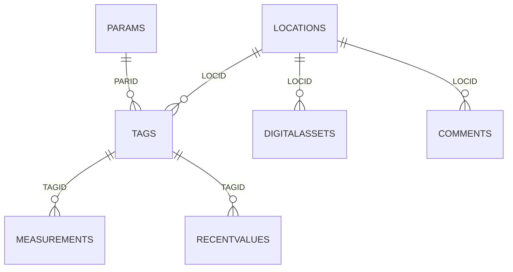

# DER logico AgroMetrIA

La base `Insights` de YDOC no declara llaves foraneas para el dominio meteorologico. AgroMetrIA la consume en modo solo lectura y aplica relaciones logicas desde el backend.

## Relaciones usadas

| Relacion | Uso |
| --- | --- |
| `locations.LOCID -> tags.LOCID` | Variables por estacion |
| `params.PARID -> tags.PARID` | Unidad y tipo fisico |
| `tags.TAGID -> recentvalues.TAGID` | Ultima lectura en tiempo real |
| `tags.TAGID -> measurements.TAGID` | Historico por rango |
| `locations.LOCID -> DigitalAssets.LOCID` | Informacion RTU |
| `locations.LOCID -> comments.LOCID` | Bitacora |

## Decisiones

- No se crean constraints fisicas porque la base pertenece a YDOC.
- `recentvalues` alimenta tarjetas de estado y alertas actuales.
- `measurements` se consulta solo con estacion, variable y rango temporal.
- HUACA se normaliza en backend porque tiene 27 tags, nomenclatura antigua y NPK con `PARID=1`.
